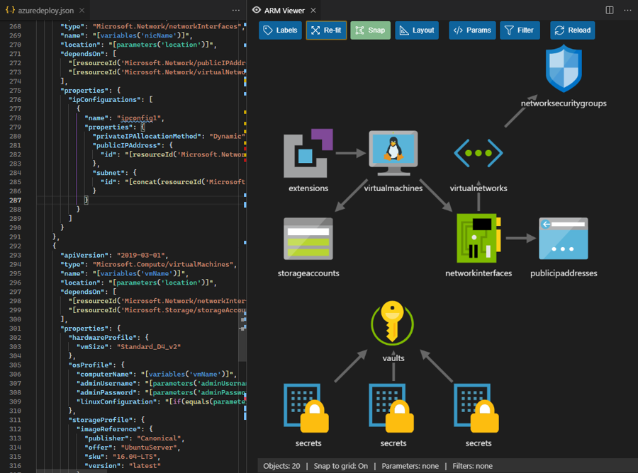
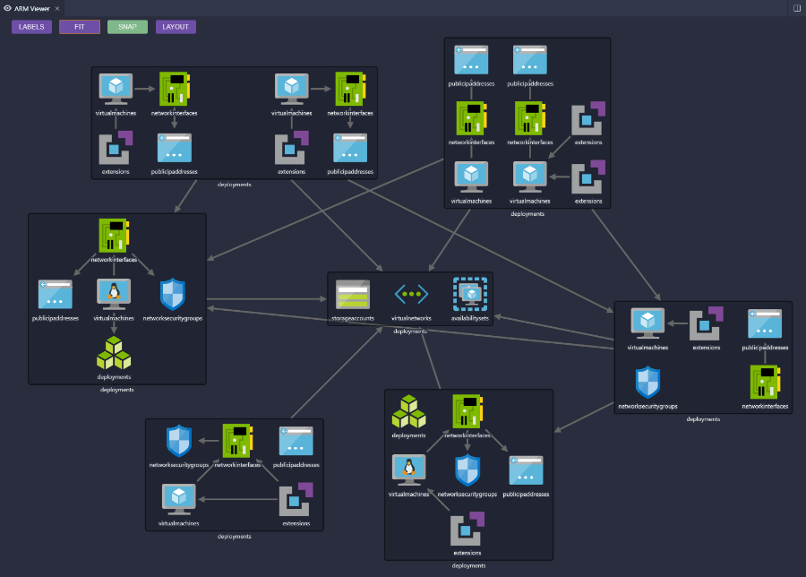

# ARM Viewer for VS Code
Display / preview Azure Resource Manager (ARM) templates in a graphical way. The view will show all resources with the canonical Azure icons and also linkage between the resources

# Usage
- Open a ARM template JSON file, make sure the editor is focused/active
- Open the VS Code command pallete with `Ctrl+Shift+P` or `⇧⌘P` on a mac
- Start typing `ARM Viewer`
- Pick `ARM Viewer: Preview ARM file graphically` from the list

## Features
- Click on a resource to show popup infobox for that resource
- Click 'LABELS' button to toggle labels from resource names to resource types
- Click 'FIT' button to refit the view to the best zoom level
- Click 'LAYOUT' button to relayout icons in default way

# Changelog
- 0.0.2 (Oct 22, 2019) - Initial release

# Notes
This is a port of a older project which was a standalone Node.js webapp https://github.com/benc-uk/azure-armviewer

This project was inspired by the old ARMViz tool. ARMViz sadly seems to have been abandoned, it often has problems displaying templates, and personally I was never that pleased with the look of the output. These are some of the reasons why I created this project

# Limitations & Known Issues 
- The code attempts to find the links (`dependsOn` relationships) between ARM resources, however due to the *many* subtle and complex ways these relationships can be defined & expressed, certain links may not be picked up & displayed.
- Icons for the most commonly used & popular resource types have been added, however not every resource is covered. The default ARM cube icon will be shown as a fallback. More icons are being added during development as missing icons are found. 
- Resolving names & other properties for resources is attempted, but due to programmatic way these are generally defined with ARM functions and expressions, full name resolution is not always possible
- Templates using the loop functions `copy` & `copyIndex` to create multiple resources will not be rendered correctly due to limitations on evaluating the dynamic iterative state of the template     
- 
## Running/Debugging Locally

- Open this example in VS Code 1.25+
- `npm install`
- `npm run watch` or `npm run compile`
- `F5` to start debugging
