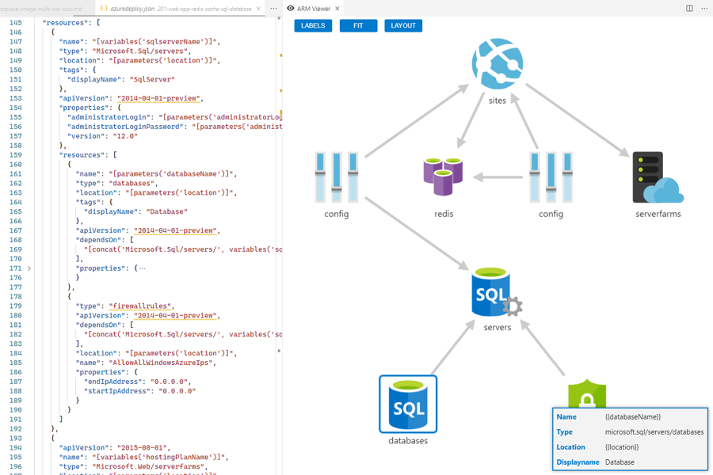

# ARM Viewer for VS Code
 

This extension displays a graphical preview of Azure Resource Manager (ARM) templates. The view will show all resources with the official Azure icons and also linkage between the resources. Uses the [Cytoscape.js library](http://js.cytoscape.org/)

You can drag and move icons as you wish, zoom in and out with the mouse wheel and drag the canvas to pan around. Clicking on a resource will show a small "infobox" with extra details

Extension as been tested successfully against all 890+ [Azure Quickstart Templates](https://github.com/Azure/azure-quickstart-templates) 😁

# Usage
- Open a ARM template JSON file, and ensure it is active/focused
  - Click the eye symbol in the top right of the editor tab bar
  - 
- Or:
  - Open the VS Code command pallet with `Ctrl+Shift+P` or `⇧⌘P` on a mac
  - Start typing `ARM Viewer`
  - Pick `ARM Viewer: Preview ARM file graphically` from the list
- Or:
  - Use keyboard shortcut `Ctrl+Alt+Q`

## Features
- Click on a resource to show popup 'infobox' for that resource
- Click 'LABELS' button to toggle labels from resource names to resource types
- Click 'FIT' button to refit the view to the best zoom level
- Click 'SNAP' button to toggle snap to grid mode on/off
- Click 'LAYOUT' button to re-layout icons in default way

## Linked Templates
The extension will attempt to locate and display linked templates, these resources will be shown grouped together in a shaded box. Linked template support is at an early stage, and comes with some limitations. This is an outline of how it works:
- If the resolved linked template URL is externally accessible, it will be downloaded and used.
- If the URL is not accessible, then an attempt is made to load the file locally based on a guess from the filename and parent dir extracted from the URL, e.g. `nested/linked.json` 
- If that fails, then the local filesystem of the VS Code workspace will be searched for the file. Some assumptions are made in this search:
  - The search will only happen if the linked file has a *different* filename from the main/master template being viewed
  - The linked template file should located somewhere under the path of the main template, sub-folders will be searched. If the file resides elsewhere outside this path it will not be located.
  - The first matching file will be used
- If linked template URL or filename is dynamic based on template parameters it is very likely not to resolve, and will not be found.
- If the linked template can not be located/loaded then a icon representing the deployment will be shown as a fallback.
- Currently there is no cache for data fetched from external URLs
- The layout of the icons/resources can initially be a bit strange, and will require some manual tidy up to look good. I'm investigating how to improve this.

# Notes
This is a port of a older *ARM Viewer* project, which was a standalone Node.js webapp https://github.com/benc-uk/azure-armviewer

This project was created as a learning exercise, but was heavily inspired & influenced by the old ARMViz tool. ARMViz sadly seems to have been abandoned, it often has problems displaying some templates. Personally I wasn't a fan of look of the output, and found it hard to read. These are a few of the reasons why I created this project

# Limitations & Known Issues 
- The code attempts to find the links (`dependsOn` relationships) between ARM resources, however due to the *many* subtle and complex ways these relationships can be defined & expressed, certain links may not be picked up & displayed.
- Icons for the most commonly used & popular resource types have been added, however not every resource is covered (There's simply too many and no canonical source). The default ARM cube icon will be shown as a fallback. Get in touch if you want a icon added for a particular resource type.
- Resolving names & other properties for resources is attempted, but due to programmatic way these are generally defined with ARM functions and expressions, full name resolution is not always possible
- Templates using the loop functions `copy` & `copyIndex` to create multiple resources will not be rendered correctly due to limitations on evaluating the dynamic iterative state of the template     

# Running/Debugging Locally
- Clone/fork repo and open project in VS Code 1.25+
- `npm install`
- `npm run watch` or `npm run compile`
- `F5` to start debugging
